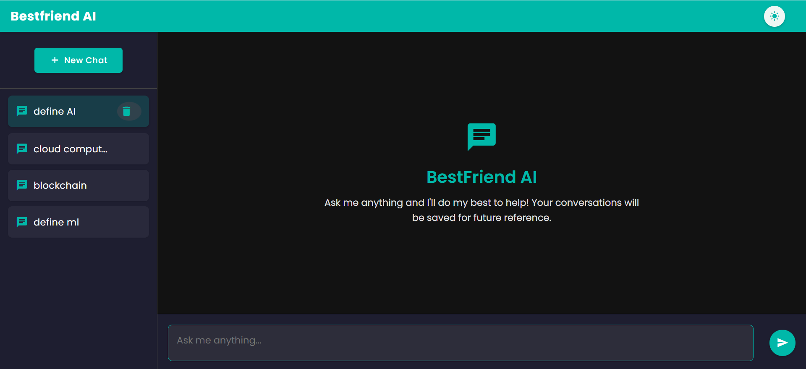
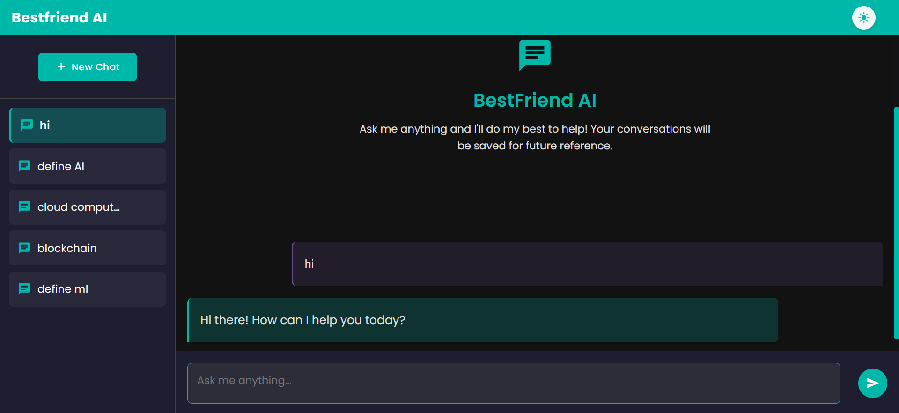

# BestFriend AI: Your Digital Confidant

## A Modern MERN Stack Application with Advanced AI Integration

Welcome to **BestFriend AI** – a sophisticated digital companion built on modern web technologies. This application seamlessly blends powerful AI capabilities with an elegant, responsive interface to create a truly immersive conversational experience.

### 🚀 Technology Stack

BestFriend AI leverages the complete MERN stack along with cutting-edge AI integration:

#### 🧠 Gemini AI Integration
Powered by Google's Gemini AI, the application delivers intelligent, context-aware responses that evolve with each conversation, creating a truly personalized experience.

#### 🔄 MongoDB & Express Backend
- **MongoDB**: A flexible NoSQL database that efficiently stores and manages conversation history
- **Express.js**: A robust Node.js framework that handles server-side logic with elegant simplicity

#### ⚙️ Advanced API Architecture
- **RESTful Endpoints**: Carefully designed API routes that manage authentication, conversation history, and AI interactions
- **Middleware Integration**: Custom middleware for request validation, error handling, and response formatting
- **Stateless Authentication**: Secure token-based authentication system for user session management

#### 🎨 Modern UI with Responsive Design
- **Adaptive Theming**: Light and dark mode support with smooth transitions
- **Responsive Layout**: Seamlessly adapts to any device or screen size
- **Interactive Elements**: Subtle animations and transitions enhance the user experience
- **Accessibility Focus**: Designed with accessibility in mind for all users

### 📸 Screenshots

Here's a glimpse of BestFriend AI in action:

#### Chat Interface




### ✨ Key Features

- **Theme Customization**: Toggle between light and dark modes to suit your preference
- **Persistent Conversations**: All dialogues are automatically saved and can be revisited anytime
- **Real-time Responses**: Experience fluid conversation with minimal latency
- **Intuitive Chat Management**: Easily create, navigate, and delete conversations
- **Clean, Distraction-free Interface**: Focus on your conversation without unnecessary clutter
- **Advanced Message Editing**: Edit your previous messages and watch as the AI regenerates contextually appropriate responses
- **Conversation Management**: Easily delete unwanted conversations with a simple click, keeping your chat history organized

### 🔧 Getting Started

To begin your journey with BestFriend AI, follow these simple steps:

```bash
# Install dependencies
npm install

# Start the development server
npm start
```
